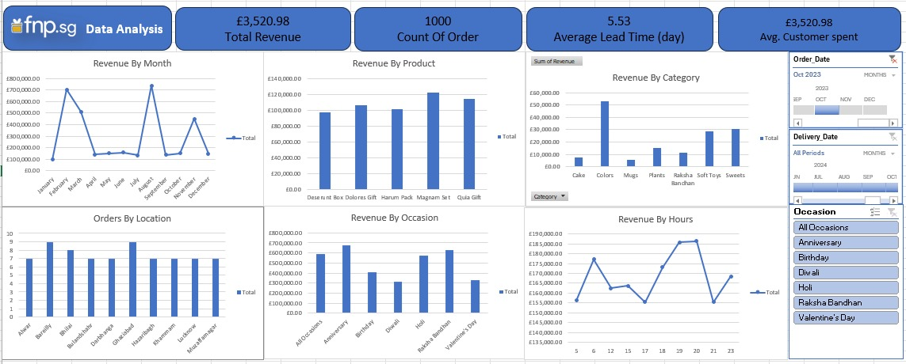

# 🌸 Ferns and Petals Sales Analysis Dashboard 📊

## 1. 🎯 The Goal
The goal of this project was to build a clear, interactive Excel dashboard that helps understand the sales performance of Ferns and Petals (FNP).  
The dashboard gives a full view on orders, revenue, product performance, delivery time, and customer behavior — all inside one simple, easy-to-read report.

This is a complete end-to-end data project using Excel: from cleaning and transforming the data to building a final dashboard using Pivot Tables, Power Query, and DAX in Power Pivot.

---

## 2. ❓ The Problem
The business needed a better way to understand their sales. Working through raw spreadsheets was slow and confusing, so the dashboard was created to answer important questions like:

- How much revenue are we making?  
- Which products and occasions are performing best?  
- What are the monthly sales trends?  
- How long does delivery take on average?  
- What locations and hours generate the most orders?  

The goal was simple: turn raw data into business insights that can help improve decisions and customer experience.

---

## 3. 📊 The Dashboard
The Excel report includes multiple visuals that cover different angles of the business:

**Included Visuals:**
- **Revenue by Month** → Shows seasonality and demand patterns.  
- **Revenue by Product** → Top-performing items.  
- **Revenue by Category** → Which category drives the most profit.  
- **Orders by Location** → How each city performs.  
- **Revenue by Occasion** → Wedding? Birthday? Valentine’s Day?  
- **Revenue by Hour** → Customer ordering behavior.  

**KPIs:**
- Total Revenue  
- Number of Orders  
- Average Delivery Lead Time  
- Average Customer Spending  

**Dashboard Screenshot**  

---

## 4. 🛠️ How I Built It

**Tools Used:**  
- Excel for:  
  - Power Query (data cleaning & transformation)  
  - Data Modeling (relationships between tables)  
  - Pivot Tables & Pivot Charts  
  - DAX in Power Pivot  
  - Dashboard layout & design  

**Data Preparation (Power Query):**  
- Removed duplicates  
- Converted data types  
- Fixed dates  
- Calculated new columns:  
  - Revenue = Price × Quantity  
  - Delivery Days = Delivery_Date – Order_Date  
  - Month, Hour columns  

**Data Model:**  
A clean star-like schema connecting:  
- Orders  
- Products  
- Customers  
- Locations  
- Dates  

This helped build smooth slicers and correct aggregations.

---

## 5. 💡 Key Insights
From analyzing Ferns and Petals sales data:

- 💰 **Strong Revenue:** Total sales reached £3,520.98.  
- 🛍️ **High Order Volume:** A total of 1000 orders were placed.  
- 🚚 **Delivery Efficiency:** Average delivery time was 5.53 days, showing room for optimizing logistics.  
- 🎁 **Best-Selling Categories:** “Gifts” and “Colors” generated the highest revenue.  
- 🌆 **Top Locations:** Some cities consistently place more orders, important for targeted campaigns.  
- 🕒 **Customer Behavior:** Orders spike during specific hours—valuable for marketing timing.  
- 🎉 **Strong Occasion Sales:** Occasions like Anniversary, Birthday, and Raksha Bandhan generated high revenue.

---

## 6. 🚀 Recommendations
Based on the insights:

1. **Improve Delivery Logistics**  
   Shortening the average delivery time will increase customer satisfaction and repeat orders.

2. **Promote High-Performing Categories**  
   Focus marketing campaigns on top categories like Gifts and Colors.

3. **Boost Underperforming Occasions**  
   Increase ads or bundles during occasions with lower sales.

4. **Location-Based Offers**  
   Run local campaigns in cities with lower order volume.

5. **Time-Based Marketing**  
   Use peak ordering hours for targeted email and SMS promotions.

---

## 8. ✍️ About Me
**Mohamed Nasser**  
Data Analyst | BI Developer | Aspiring Data Scientist  

[LinkedIn](https://www.linkedin.com/in/mohamednasser)  
Email: mohamedhamasahhh@gmail.com
